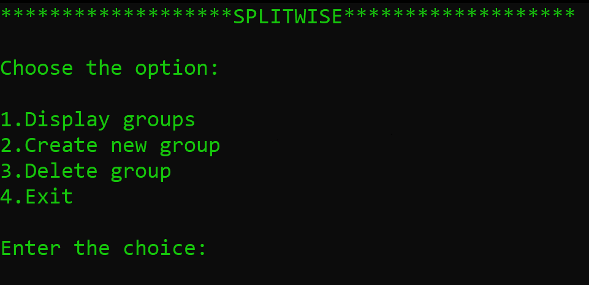

<h1> [Splitwise-app] </h1>

### [Built-with]
C-language

### [Installation]
Clone the repo in your system. To get started your system should have gcc complier to compile the source file.
For installation, download necessary software to support C language.

### [Get started]
Once installation is completed, compile the source file that is Splitwise.c and terminal will open with diffrent options:
1) Display groups
2) Create new group
3) Delete group
4) Exit  

Choose the options accordingly and get started with splitwise app.

Splitwise app helps to manage transactions between group members, which will be easy to handle.
